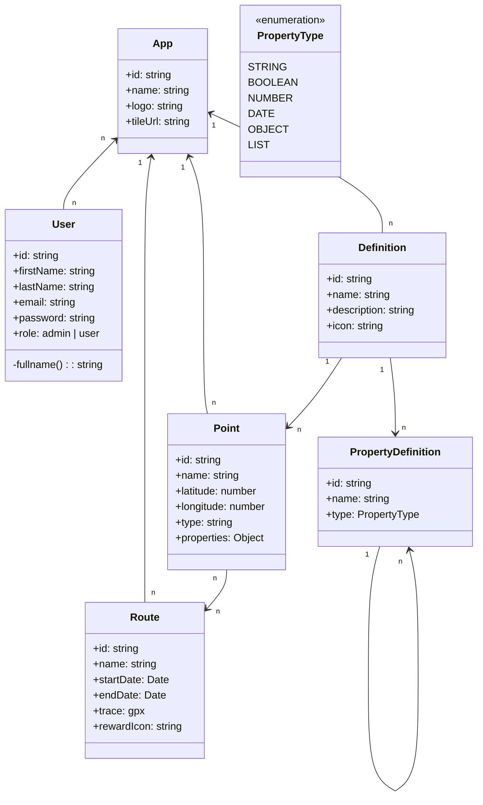

# QRCols Backend
Backend server of QRCols
## Dependencies

- [Nest](https://github.com/nestjs/nest) framework
- TypeOrm
- openApi

## Installation

```bash
$ yarn install
```

## Running the app

```bash
# development
$ yarn run start

# watch mode
$ yarn run start:dev

# production mode
$ yarn run start:prod
```

## Test

```bash
# unit tests
$ yarn run test

# e2e tests
$ yarn run test:e2e

# test coverage
$ yarn run test:cov
```

## UML Diagram


